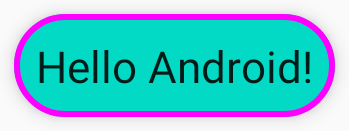
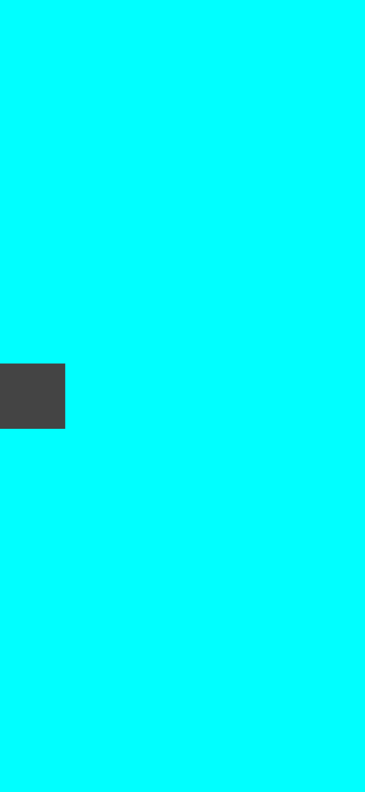
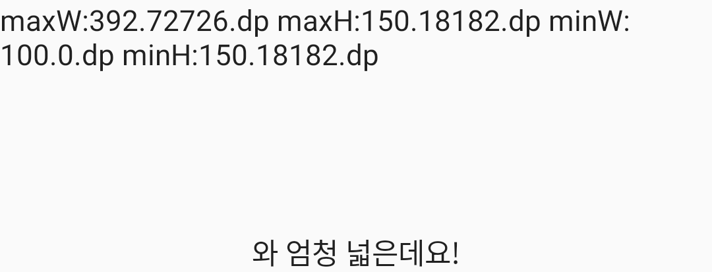
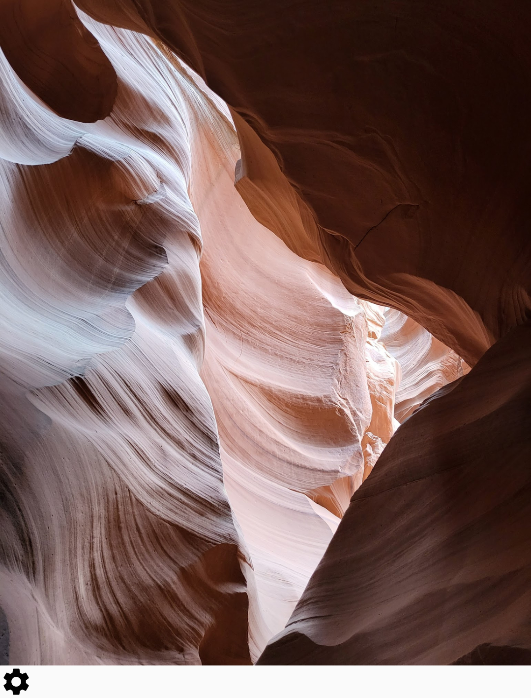

# Part4 Chapter3

Part4 Chapter3의 예제와 실습을 모두 담고 있습니다.

[최종본](../../tree/final)과 비교해보세요.

## Compose Text 실습코드 (part4-chapter3-2)

[part4-chapter3-2](part4-chapter3-2) 디렉토리를 Android Studio에서 오픈하세요.

Compose Text 실습코드

 * 스텝 1: 색상을 지정하기 위해 color 파라미터에 Color.Red를 전달해봅시다.
 * 스텝 2: Color 객체를 이용해서 해쉬값으로 색상을 전달해봅시다. (ARGB 순)
 * 스텝 3: fontSize 파라미터에 30.sp를 전달해봅니다.
 * 스텝 4: fontWeight에 FontWeight.Bold를 전달해봅시다.
 * 스텝 5: fontFamily에 FontFamily.Cursive를 전달해봅시다.
 * 스텝 6: letterSpacing에 2.sp를 지정해봅시다.
 * 스텝 7: maxLines를 2로 지정하고 문자열을 더 추가해봅시다.
 * 스텝 8: textDecoration에 TextDecoration.Underline을 추가합시다.
 * 스텝 9: textAlign을 TextAlign.Center로 지정합니다.

## Compose Button 예제 (part4-chapter3-3)

[part4-chapter3-3](part4-chapter3-3) 디렉토리를 Android Studio에서 오픈하세요.

Compose Button 예제

 * 스탭 1: Button을 클릭했을 때 Toast를 출력하게 만들어봅시다.
 * 스탭 2: Icon을 Text 앞에 추가시켜봅시다. imageVector에는 Icons.Filled.Send를 넣고 contentDescription에는 null을 넣어봅시다.
 * 스탭 3: 아이콘과 텍스트 사이에 Spacer를 넣어봅시다. modifier에 Modifier.size를 넣고 사이즈를 ButtonDefaults.IconSpacing을 지정합시다.
 * 스탭 4: enabled를 false로 바꾸어봅시다.
 * 스탭 5: border에 BorderStroke를 설정합시다.
 * 스탭 6: shape를 CircleShape로 지정합시다.
 * 스탭 7: contentPadding에 PaddingValues를 설정합시다.

## Compose Modifier 예제 (part4-chapter3-4)

[part4-chapter3-4](part4-chapter3-4) 디렉토리를 Android Studio에서 오픈하세요.

Compose Modifier 예제

 * 스텝 1: modifier에 Modifier.fillMaxSize()를 사용해봅시다.
 * 스텝 2: fillMaxSize대신 Modifier.height를 설정해봅시다.
 * 스텝 3: modifier에 height와 width를 같이 설정해봅시다.
 * 스텝 4: size에 width와 height를 인자로 넣을 수도 있습니다.
 * 스텝 5: background를 설정해봅시다. (버튼에서는 되지 않음.) Button에 되지 않으면 Text나 Icon에 지정해봅시다.
 * 스탭 6: colors 파라미터에 ButtonDefaults.buttonColors를 넣어보세요. backgroundColor와 contentColor 프로퍼티를 설정하세요.
 * 스텝 7: Button의 modifier에 padding을 추가해봅시다.
 * 스탭 8: Button에 enabled를 false로 설정하고, Text의 modifier에 clickable을 넣어봅시다.
 * 스탭 9: Text의 modifier에 offset를 설정하고 x 파라미터를 설정합니다.

## Compose Surface 예제 (part4-chapter3-5)

[part4-chapter3-5](part4-chapter3-5) 디렉토리를 Android Studio에서 오픈하세요.

Compose Surface 예제

 * 스텝 1: Surface에 elevation을 설정합시다.
 * 스텝 2: border의 값을 설정해봅시다.
 * 스텝 3: Surface의 shape도 설정해봅시다.
 * 스텝 4: color를 지정합시다.

MaterialTheme.colors에서 primary, error, background, surface, secondary 등을 지정해봅시다.

contentColor가 자동으로 선택됩니다.

## Compose Box 예제 (part4-chapter3-6)

[part4-chapter3-6](part4-chapter3-6) 디렉토리를 Android Studio에서 오픈하세요.

Compose Box 예제

 * 스텝 1: Text 두개를 Box 안에 배치해봅시다.
 * 스텝 2: 2개의 Box를 Box 안에 배치하고 사이즈를 70dp, 색상을 각기 다르게 해봅시다.
 * 스텝 3: 부모 Box에 modifier 설정을 제거해서 콘텐트 사이즈만큼 보여주게 합시다.
 * 그리고 첫번째 자식 Box의 사이즈를 matchParentSize()로 설정해봅시다. 
 * 다음에는 fillMaxSize()로 설정해봅시다.

## Compose Row 예제 (part4-chapter3-7)

[part4-chapter3-7](part4-chapter3-7) 디렉토리를 Android Studio에서 오픈하세요.

Compose Row 예제

 * 스텝 1: 각 Text의 modifier에 align을 설정합시다. Alignment.Top, CenterVertically, Bottom을 지정해봅시다.
 * 스텝 2: Row에 verticalAlignment를 설정해봅시다. Text에 align을 사용할 때와 쓰이는 값이 같습니다.
 * 스텝 3: Row의 height를 200dp 정도로 설정합시다. Row에 horizontalArrangement에 Arrangement.Center를
   설정해봅시다. Start, End, SpaceAround, SpaceBetween SpaceEvenly를 설정해봅시다.
 * 스텝 4: horizontalArrangement를 제거하고 각 Text에 Modifier.weight를 설정합시다. 
   각 항목의 weight 값을 바꾸어 보세요.
 * 스텝 5: Text 대신 Icon을 하나 넣어봅시다.

## Compose Column 예제 (part4-chapter3-8)

[part4-chapter3-8](part4-chapter3-8) 디렉토리를 Android Studio에서 오픈하세요.

Compose Column 예제

 * 스텝 1: horizontalAlignment를 Column에 적용해봅시다.
 * 스텝 2: Column에 verticalArrangement를 지정해봅시다. SpaceAround, SpaceEvenly, SpaceBetween도 해봅시다.
 * 스텝 3: Text에 Modifier.align을 사용해 봅시다.

## Compose Box with Constraints 예제 (part4-chapter3-9)

[part4-chapter3-9](part4-chapter3-9) 디렉토리를 Android Studio에서 오픈하세요.

Compose Box with Constraints 예제

 * 스텝 1: Inner 인자로 modifier를 전달해봅시다. 기본 값을 Modifier로 지정합시다.
  파라미터로 받은 modifier를 BoxWithConstrains에 전달합시다.
 * 스텝 2: Inner의 인자로 Modifier.widthIn(min = 100.dp)를 전달해봅시다. heightIn도 전달해봅시다. 각각 인자의 max값도 전달해봅시다.
 * 스텝 3: maxHeight 값이 150dp가 넘을 때만 추가로 텍스트를 출력해봅시다.
 * 스텝 4: Column에 width를 지정해서 제한해 봅시다.

## Compose Image 예제 (part4-chapter3-10)

[part4-chapter3-10](part4-chapter3-10) 디렉토리를 Android Studio에서 오픈하세요.

Compose Image 예제

 * 스텝 1: Image를 만들어봅시다. painter 항목에 painterResource(id = R.drawable.wall)
contentDescription에 엔텔로프 캐년이라고 넣읍시다.
 * 스텝 2: 두 번째 Image를 만들어봅시다. imageVector에 Icons.Filled.Settings를 설정해봅시다.